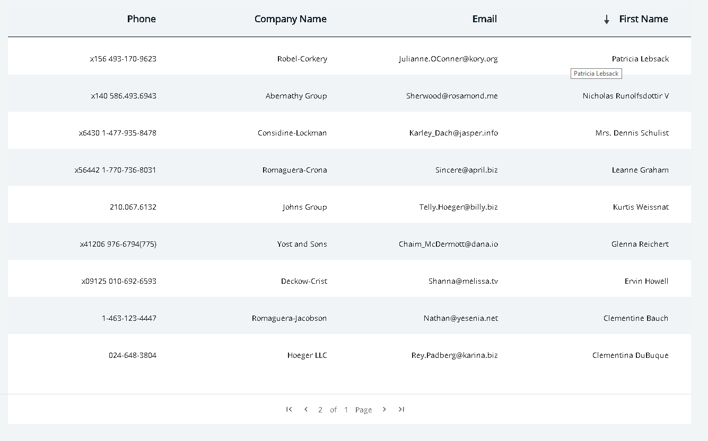
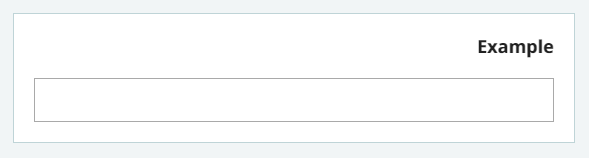

## **מסמך הטמעה moh-package 1.3.0**

## תקציר:

Package 1.3.0 מכיל תיקוני באגים ותיקוני נגישות, רכיב טבלה בסיסי, הוספת directive mohDir , הוספת רכיבי תצוגה, טיפול בשינוי כיוון עבור מצבים מיוחדים בעת החלפת שפה.

**באגים שטופלו:**

1. טיפול ב file upload באקספלורר.
2. נראות הפוקוס על רכיב ה .wizard

**היכולות שנוספו:**

1. נוסף service  להחלת הגדרות עבור שימוש ב ag-grid, תומך בדפדוף,סינון ומיון עמודות
2. נוסף רכיב לניהול form Array.
3. נוסף אפשרות לשנות את ה title של הטאב של הדפדפן בשינוי שפה.
4. נוספה תמיכה ב ariaLabel  מתורגם (עבור נגישות)
5. נוספו Inputs ברכיב header עבור רכיב בחירת השפה הנמצא בתוכו
6. נוסף רכיב להצגת rich text  מאומברקו
7. אפשרות לשלוח ng-content לרכיב moh-info
8. נוסף רכיב moh-form-card
9. נוספה פונקציה לשליפת השפות מאומברקו.
10. נוסף directive mohDir

## הטמעה:

1. עבור פרויקט המשתמש במנגנון  של  ה translate התשתיתי -
יש להשתמש ב directive  :mohDir
  - להוסיף import DirectivesModule
  - להוסיף לתגית הראשית בקובץ app.component.html :
  ```html
   mohDir="rtl"
  ```
2. הצגת טקסט מאומברקו:
עד עתה היה ניתן להציג טקסט מאומברקו ע&quot;י שליחת מפתחות הנמצאים באומברקו ומוגדרים עבור התשתית.
בגרסה זו נוספה אפשרות להשתמש במפתחות ספציפיים לאפליקציה הנוכחית,

וכן אם קיים מפתח מסוים גם עבור התשתית וגם עבור האפליקציה הנוכחית יתקבל הערך של האפליקציה הנוכחית.

כדי להטמיע יכולת זו יש להוסיף את הערך הבא בקובץ environment:
```json
appName="myAppName"
```
כאשר שם האפליקציה צריך להיות תואם לשם האפליקציה באומברקו.

## תיקוני באגים:

1. File upload – ב explorer היה שגיאה בקונסול בלחיצה על כפתור הוספת קובץ, טופל ע&quot;י גישה לפרופרטי אחר בקוד.
2. נראות הפוקוס על רכיב ה wizard טופל ב css.
3. כפתור &quot;חזור לאתר משרד הבריאות&quot; ברכיב header-
שינוי ה url ל &quot;https://www.health.gov.il&quot;

## שימוש ביכולות:

**Grid Service**

הוספת service המאפשר לקבל הגדרות ברירות מחדל הנהוגות בארגון עבור הרכיב ag-grid
 


**הטמעה** :

1. **מומלץ להתנסות בלינק הבא עבור** [**יצירת ag-grid בסיסי**](https://www.ag-grid.com/angular-getting-started/) **, הסיפריות של ag-grid אמורות להיות מוטמעות כבר בתוך moh-package  .**

**רק במקרה שה grid לא מוצא את הספריות ניתן להתקין אותן ידנית ע&quot;י הרצת הפקודות**

```
npm install --save ag-grid-community ag-grid-angular
npm install # in certain circumstances npm will perform an "auto prune". This step ensures all expected dependencies are present
```

**שימוש ביכולות:**

1. יש להזריק את ה service בקומפוננטה שמכילה את ag-grid
```typescript
constructor(private gridService: MohGridService)
```
2. יש ליצור משתנה מסוג GridOptions שאליו יכנסו ההגדרות הכלליות של ה grid מה service וכן מערך מסוג ColDef[] שיכיל את כל העמודות :
```typescript
private gridOptions: GridOptions;
private columns: ColDef[];
```
3. ע&quot;מ לקבל את הגדרות הגריד מהservice יש להשתמש בפונקציה getMohGridOptios ב constructor או ב ngOnInit:
```typescript
this.gridOptions = this.gridService.getMohGridOptions();
```
4. את ה Data יש לאתחל בעזרת משתנה נוסף לדוגמא **:**
```typescript
private rowData: Student[];
```
וב ngOnInit
```typescript
this.userService.getUser().subscribe(res => this.rowData = res);
```
  (את rowData נעביר ב html ל ag-grid)

5. כעת יש לאתחל את המערך שמכיל את הגדרות העמודות .
בשלב זה ה service מאפשר שימוש בהגדרות עבור עמודה בסיסית ללא עיצוב – **getColumn** ועמודה עם תוספות עיצוביות מותאמות למב&quot;ר – **getMohColumn**

הפונקציות מקבלות 2 פרמטרים ומחזירות ColDef
הפרמטרים:
- field- מסוג string , מקבל את שם העמודה, בהעדר הגדרות נוספות שם זה יהיה גם הid של העמודה,גם השם של האוביקט שרוצים להציג בשדה הזה וגם הכותרת **לדוג&#39;:**
```typrscript
  this.columns = [
      this.gridService.getColumn('name'),
      this.gridService.getColumn('email'),
      this.gridService.getMohColumn('phone'),
];
```
יציג את הנתונים name,email,phne מתוך קובץ הjson  הבא בהתאמה

```json
]
  }
  "id": 1,
  "name": "Leanne Graham",
  "username": "Bret",
  "email": "Sincere@april.biz",
  "phone": "0509999999",
  {,
  }
  "id": 2,
  "name": "Ervin Howell",
  "username": "Antonette",
  "email": "Shanna@melissa.tv",
  "phone": "0509999999",
  {,
```

- **ColDef** – אופציונאלי, ניתן לשלוח colDef מאותחל בההגדרות האישיות של המשתמש. לדוג&#39; עבור עמודה עם כותרת מותאמת אישית ניתן לשלוח :
```typescript
this.gridService.getMohColumn('name', {headerName: 'First Name'} as ColDef)
```

2. דוגמא ליצירת ag-grid  ושליחת הפרמטרים הנ&quot;ל ב html:

```html
<ag-grid-angular class="container ag-theme-material"
                   [rowData]="rowData"
                   [columnDefs]="columns"
                   [gridOptions]="gridOptions"
                   style="height:100%;"> </ag-grid-angular>

```

נ.ב ע&quot;מ שהגריד יוצג יש לתת לdiv שעוטף אותו גובה קבוע

**Grid Sorting**

ברירת המחדל של ה service  היא לאפשר sorting במידה ורוצים לשנות את ההגדרה ניתן לעשות זאת מיד לאחר קבלת הנתונים מה service :

```typescript
this.gridOptions = this.gridService.getMohGridOptions();this.gridOptions.enableSorting = false;
```

**Grid Filtering**

ברירת המחדל של ה servise  היא grid ללא filtering במידה ורוצים לשנות את ההגדרה ניתן לעשות זאת מיד לאחר קבלת הנתונים מה service :

```typescript
this.gridOptions = this.gridService.getMohGridOptions();
this.gridOptions.enableFilter = true;
```

**Grid Pagination**

ברירת המחדל של ה servise  היא grid עם pagination במידה ורוצים לשנות את ההגדרה ניתן לעשות זאת מיד לאחר קבלת הנתונים מה service :

```typescript
this.gridOptions = this.gridService.getMohGridOptions();
this.gridOptions.pagination = false;
```

**Form Array Template**

הוספת רכיב לניהול Form Array.

הרכיב נועד לטפל ב form array. הוא מאפשר הוספת פריט ומחיקת פריט מהמערך.

הקומפוננטה המארחת תגדיר בין תגיות ה `<moh-form-array-template>` תגית של `<ng-template>` ובתוכה את המבנה של ה html אותו רוצים לשכפל.

Selector: `moh-form-array-template`

Module: `FormArrayTemplateModule`

@Inputs:

1. `formArray: FormArray` –

מקבל את המערך אותו רוצים לנהל.

2.  `abstractControl: AbstractControl` –

מקבל את המבנה של ה controls אותם מכיל המערך.

3. `maxLength: number` –

מקבל את האורך המקסימלי של המערך (אופציונלי)

4. `enableRemove: boolean = true` -

מגדיר האם לאפשר מחיקת פריטים מהמערך (ברירת מחדל true).

5. `enableFirstItemRemove: boolean  = true`

מגדיר האם לאפשר את מחיקת הפריט הראשון מהמערך (ברירת מחדל true).

6. `addButtonTextKey: string`

מקבל את ה key  של הטקסט באומברקו שיוצג על כפתור ההוסף  (קיים ברירת מחדל לטקסט)

אופן השימוש:

Ts:

יש להגדיר formControl המייצג את המערך. לדוגמא:
```typescript
this.demoForm = this.fb.group({
    formArray: new FormArray()
});
```
יש להגדיר את מבנה ה abstractControl אותו מיצג המערך.

לדוגמא:
```typescript
this.absControl = this.getArrayItem();

getArrayItem(): AbstractControl{
   return new FormGroup({
      name: new FormControl('', [mohValidators.minLength(2)]),
      address: new FormGroup({
        city: new FormControl('ירושלים', [mohValidators.required()])
      })
    }) 
  }
```    

כמובן שניתן גם לאתחל את המערך עם control/s. לדוגמא:

```typescript
this.demoForm = this.fb.group({
      formArray: new FormArray([this.getArrayItem()])
});
```


Html:

יש לשים את שם ה selector של ה component ולשלוח לה את ה inputs המפורטים למעלה.

בין תגיות ה `<moh-form-array-template>` יש להגדיר `<ng-template>` ועליו לשים  `templateRef#` – חובה בדיוק כך. וכן `let-{parameterName}`. פרמטר זה מכיל את האובייקט הנוכחי במערך ואת ה index שלו. באמצעותו ניתן לגשת לכל control במערך.

בין תגיות ה `<ng-template>` יש לשים את ה html אותו רוצים לשכפל עבור כל פריט במערך.

לדוגמא:
```html
<moh-form-array-template [formArray]="demoForm.controls.formArray"  [abstractControl]="absControl" [maxLength]="3" 
[enableRemove]="true" [enableFirstItemRemove]="true">
    <ng-template #templateRef let-item> 
         <moh-textbox [formControl]="item.control.get('name')" textKey="name"></moh-textbox>
         <moh-error-message *ngIf="item.control.get('name').touched ||  
             demoForm['submitted']"  
             [control]="item.control.get('name')"></moh-error-message>
          <moh-textbox [formControl]="item.control.get('address').get('city')" 
             textKey="cityId"></moh-textbox>
          <moh-error-message      
             *ngIf="item.control.get('address').get('city').touched || 
             demoForm['submitted']" 
           [control]="item.control.get('address').get('city')">   
          </moh-error-message> 
    </ng-template>
</moh-form-array-template>
```


**Translate**

הוספת יכולת לתרגם את ה title של הטאב בדפדפן, כך שה – title ישתנה בהתאם לשפה של האתר.

אופן השימוש:

ב app.component יש להזריק את MohTranslateService.

```typescript
constructor(private translate: MohTranslateService) {}
```

בפונקציה ngOnInit() יש להגדיר את ה title כך:

```typescript
this.translate.setTitleKey('appTitle');// appTitle – המפתח באומברקו 
```

אם משתמשים ביכולת הזו ניתן להוציא את הטקסט שיושב בין תגיות ה `<title></title` בקובץ  index.html.

**Accessibility**

כל רכיב מכיל attribule של aria-label ע&quot;מ שקורא המסך ידע להקריא למה שייך השדה.

כברירת מחדל הערך של ה aria-label יהיה זהה לטקסט של הערך של ה label של הרכיב. למשל אם ה label של הרכיב הוא &quot;שם פרטי&quot; גם ה aria-label של ה textbox יהיה &quot;שם פרטי&quot;.

במידה ורוצים לשנות את הערך של ה aria-label (או אם לשדה אין label) ניתן לשלוח ariaLabelKey עם המפתח של הטקסט מאומברקו.

לדוגמא: 
```html
<moh-select formControlName="prefix" ariaLabelKey="prefix"></moh-select>
```

**Select Language component**

נוסף @Input `languagesListApps:string`

ה Input מקבל את שם האפליקציה\ אפליקציות עבורה תישלף רשימת השפות מאומברקו.

במקרה שרוצים להציג צריף של כמה רשימות ניתן לשלוח מספר שמות מופרדים בפסיקים.

אם לא ישלח ערך – הרכיב יציג את רשימת השפות של התשתית.

**Header component**

רכיב ה header מכיל את הרכיב select-language,

לשם כך נוספו לו מספר @Inputs :

@Input:

1. `showSelectLanguage: Boolean` –

האם להציג את הרכיב של בחירת השפה, ברירת המחדל היא true

2. `selectLanguageLabelTextKey:string` –

מקבל את המפתח מאומברקו של הכותרת שתופיע מעל השדה של בחירת השפה

3. `languagesListApps:string` –

שם האפליקציה\ אפליקציות עבורה תישלף רשימת השפות מאומברקו.

ערך זה ישלח כפרמטר ל languagesListApps Input שברכיב select-language

4.  `currentLang: string` –

מקבל את השפה הנוכחית (בשתי אותיות קטנות לדוג: אנגלית- en)
ערך זה ישלח כפרמטר ל currentLang Input שברכיב select-language

**RichTextMessage component**

נוסף רכיב להצגת טקסט עשיר מאומברקו.

@Input:

1. `messageKey: string` –

מקבל את המפתח של הטקסט העשיר מאומברקו

כדי להשתמש ברכיב יש להוסיף את ה module RichTextMessageModule,

דוגמה:

```html
<moh-rich-text-message messageKey="welcomeRichText"></ moh-rich-text-message>
```

**Safe Html Pipe**

נוסף pipe המאפשר הצגת innerhtml יחד עם העיצוב שלו המוגדר ב attribute של ה style,

לדוגמה כדי להציג את ה html הבא כ innerHTML עם העיצוב:
```typescript
innerHtml = '<span style="color:red"></span>';
```

יש להוסיף ה module RichTextMessageModule

ולהשתמש ב pipe כך:

```html
<div [innerHTML]="innerHtml | safeHtml"></div>
```

**Info component**

הרכיב `moh-info` מציג מידע, עד עתה הוא הכיל @Input שמקבל טקסט פשוט.

בגירסה זו נוספה אפשרות לשלוח html  לרכיב באופן של ng-content.

לדוגמה:

```html
<moh-info><h2>my info text</h2></moh-info> 
```

**Form card component**

נוסף רכיב moh-form-card המשמש מעטפת ל card

@Input:

`titleKey:string` – מקבל את מפתח הכותרת של הרכיב

כדי להשתמש ברכיב יש להוסיף :

`Import FormCardModule`

```html
<moh-form-card titleKey="myTitleKey"><div>…</div></moh-form-card>
```

דוגמה:

 

**Umbraco data service**

לשירות umbracoDataService נוספה פונקציה ייעודית לשליפת השפות מאומברקו: getLanguages

הפונקציה מקבלת את רשימת שמות האפליקציות עבורן תישלף רשימת השפות מאומברקו. אם לא נשלח ערך תישלף הרשימה של התשתית.

הפונקציה מחזירה  של רשימת השפות.

**Direction directive**

נוסף directive שאחראי לשינוי כיוון האתר בעת החלפת שפה.

מקבל כ Input את הכיוון ההתחלתי rtl/ltr ומשנה את כיוון הדף (התגית הראשית) בהתאם לשפה הנוכחית.

כדי להשתמש בו יש להוסיף import DirectivesModule, וכן להוסיף לתגית הראשית בקובץ app.component.html : `mohDir="rtl"`