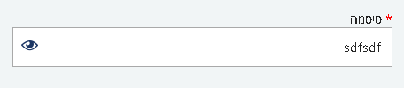
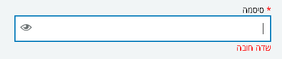
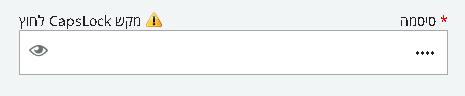
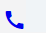

## **מסמך הטמעה moh-package 1.3.1**

## תקציר:

Package 1.3.1 מכיל שרות קונפיגורציה, תוספות קטנות, ותיקונים נוספים.

**באגים שטופלו:**

1. רכיב moh-datepicker : הצגת הודעת שגיאה במקרה שהוזן תאריך גדול מידי או קטן מידי.
2. File upload:

- הצגת שגיאה ברורה יותר במקרה שסוג הקובץ אינו תקין.
- הצגת הודעת השגיאה באדום.
- הסרת הודעת השגיאה בהעלאת קובץ חדש.
- ביטול המרכאות הכפולות מה- file guid

3. Header:

- קישור הלוגו ל- [www.health.gov.il](http://www.health.gov.il)
- קישור הכפתור לדף הבית של **האתר**.

**היכולות שנוספו:**

1. שרות לטעינת קובץ קונפיגורציה לאפליקציה.
2. נוסף רכיב password להכנסת סיסמה
3. שרות לשליפת רשימות עפ&quot;י קוד הרשימה וקוד האתר.
4. עבור הרכיב moh-datepicker : אפשרות לשליחת מערך ולידציות.
5. אפשרות להסתרת כפתור חזור לדף הבית ב header
6. אפשרות להוספת טקסט נוסף תחת רכיב הfile upload
7. נוספו component  עבור ag-grid  המאפשרות הגדרה מהירה של עמודות מסוג date   ו link .
8. הוטמע  font **moh-icon** – המכיל איקונים בסיסים של matrial  +  איקונים נוספים, ניתן לראות ב compodoc את תצוגת האיקונים כולל הclass המתאים לכל איקון.

## הטמעה:

1. יש להוסיף קובץ config.json (אפשר להוסיף אותו לתיקייה assets)

    הקובץ יכיל את האובייקט הבא:

    ```json
    "moh-package": {
        "appId": 1,  //optional – the appId in the database (sql)
        "appName": 'AppName',  //optional -  the app name in umbraco
        "servicesApiURL": "http://servicesapi.dev.health.gov.il/",
        "umbracoApiURL": "http://umbracodataproviderapi.dev.health.gov.il/",
        "draftApi": "/api/draft/"
    }
    ```

    יש לעדכן את הערכים המתאימים לכל אפליקציה , וכן לעדכן את הקובץ בהתאמה עבור כל סביבה.

2. יש לשנות את הקריאה לפונקציה `MohPackageModule.configure`  
הקריאה נמצאת הקובץ app.module במערך של ה imports :  
לשלוח את הנתיב של הקובץ config.json במקום לשלוח את ה environment
)אפשר לשמור את הנתיב של הקובץ בקובץ environment.ts)

## תיקוני באגים:


## שימוש ביכולות:

**Configuration Service**

נוסף שרות המנהל את הקונפיגורציה ש האפליקציה.

השרות טוען קובץ json המכיל את ערכי הקונפיגורציה וחושף את הנתונים לשימוש בכל מקום באפליקציה.

השרות מכיל מאפיין configuration המחזיר אובייקט json המכיל את ערכי הקונפיגורציה.

כדי להשתמש בשרות זה יש לייבא את השרות ולהזריק את ה service ב constractor של הרכיב \ השרות :

```typescript
Import {configService} from 'moh-package';
```
```typescript
constructor(private configService:ConfigService){}
```
יש להוסיף את הערך המבוקש בקובץ הקונפיגורציה ולהשתמש בו כך:

```typescript
let url = this.configService.configuration.url;
```

**Password**

**יכולות**

הוספת רכיב להכנסת סיסמה  

 

איקון עין מאפשר לצפות בסיסמה. בלחיצה על האיקון הסיסמה מוצגת ובלחיצה חוזרת היא שבה להיות מוצפנת:  


ישנה אפשרות להוסיף רכיב תשתית של ולידציה ולהפעילו על רכיב הסיסמה הודעת השגיאה תוצג בארוע touched:  



 זיהוי Caps lock דלוק- במידה והמקש caps lock לחוץ תופיע הודעה מעל התיבה לצד כותרת התיבה:  


Translations- ישנה אפשרות לשלוח טקסט /key עבור התוית מעל לתיבה (&quot;סיסמה&quot;) ועבור ההודעה &quot;מקש capsLock לחוץ&quot;

Direction- בהחלפת שפה Rtl/Ltr מיקומם של רכיבי הקומפוננטה משתנים בהתאם.

**קוד להטמעה:**

רכיב שפה בסיסי:

```html
<moh-password formControlName="password" ></moh-password>
```

רכיב שפה עם שליחה של כמה Inputs   ורכיב validation על הסיסמה:

```html
<moh-password formControlName="password" [MarkAsRequired]=true [maxlength]=10 [textKey]="password"  ></moh-password>
<moh-error-message *ngIf="demoForm.controls.password.touched || !!demoForm['submitted']" [control]="demoForm.controls.password"></moh-error-message>
```

רשימת  inputs הניתנים לשליחה:

- `textKey : string`

    Key של התרגום מאומברקו עבור התוית שמעל לתיבה

- `labelText: string`

    טקסט עבור התגית שמעל לתיבה

- `textKeyCapsLock : string`

    Key של התרגום מאומברקו עבור ההודעה &quot;מקש capslock  לחוץ&quot;, באם לא נשלח תופיע הודעה זו

- `labelTextCapsLock : string`

    טקסט עבור ההודעה &quot;מקש capslock  לחוץ&quot;, באם לא נשלח תופיע הודעה זו

- `'' = placeholder: String`

    טקסט שיופיע ברקע תיבת הסיסמה        

- `'' = placeholderKey: String`

    Key לטקסט שיופיע ברקע תיבת הסיסמה      

- `maxlength : number`

    מקסימום תווים לתיבת סיסמה

- `MarkAsRequired : bool`

    יציג כוכבית אדומה לצד התוית שמעל לתיבת סיסמה


**Data Service**

נוספה פונקציה:

```typescript
 getListByCode(listCode:string, appId?:number) : Observable<any[]>
```

הפונקציה מקבלת את קוד הרשימה ואת קוד האפליקציה (כפי שמופיעים בטבלת הרשימות במסד הנתונים).

אם לא נשלח ערך עבור הפרמטר appId - הפונקציה תשלוף את ה appId מערכי הקונפיגורציה שהוגדרו. (באובייקט &quot;moh-package&quot;)

**Datepicker**

נוסף @Input בשם:

`validator:ValidatorFn`

ה input מקבל מערך של פונקציות מסוג ValidatorFn ומוסיף אותן לפונקציות הוולידציה של הרכיב.

**File Upload Component**

אפשרות להוספת טקסט נוסף תחת הקומפוננטה עם הסבר כללי.

נוספו ה inputs הבאים:

- `additionalInfoTextKey: string` –

    מקבל את המפתח של הטקסט שנמצא באומברקו.

- `additionalInfoTextParams: any` –

    מקבל את הפרמטרים (במידה וקיימים) של הטקסט שנמצא באמברקו.

דוגמא לשימוש:

```html
<moh-file-upload [uploaderSettings]="settings"
                           [buttonText]="'+ בחר קובץ'"
                           [fieldText]="'תיאור הקובץ'"
                           formControlName="uploader"
                           [MarkAsRequired]=true
                           [additionalInfoTextKey]="'myTextKey'"
                           [additionalInfoTextParams]="{allowMimeTypes:'txt,pdf'}">
          </moh-file-upload>
```
 
כאשר הטקסט באומברקו הוא: &quot;ניתן להעלות קבצים מסוג {{allowMimeTypes}}&quot;

**Header Component**

הוספת פרמטר האם להציג או להסתיר את כפתור חזור לדף הבית.

נוסף ה input הבא:

`showBackToHomeButton: Boolean = true`

ברירת המחדל היא true.

דוגמא לשימוש:

```html
<moh-header showBackToHomeButton="false"></moh-header>
```

**Moh-ag-grid.module**

יש להוסיף את ההגדרות ל app.moudle.ts

```typescript
import {MohAgGridModule, LinkCellRendererComponent, DateCellRendererComponent} from 'moh-package';

imports:[
    ...
    MohAgGridModule,
    AgGridModule.withComponents([
      LinkCellRendererComponent,
      DateCellRendererComponent
    ])
    ...
]
``` 

דוגמה לשימוש ב html
```html
<div fxFlex="90%" style="height: 460px; "> 
    <ag-grid-angular class="container ag-theme-material"
                   fxLayout="column"
                   fxFlexFill
                   [rowData]="rowData"
                   [columnDefs]="columns"
                   [gridOptions]="gridOptions"
                   style="height:100%;">
  </ag-grid-angular>
</div>
```

דוגמה לשימוש בts
```typescript
constructor(private userService: TableDataService, 
private gridAgService: MohAgGridService) {
    this.gridOptions = this.gridAgService.getMohGridOptions();
}

this.columns = [
      this.gridAgService.getMohColumn('name'),
      this.gridAgService.getMohLinkColumn('email', 'Email_Label', '', "/wizard/address", ["name"]),
      this.gridAgService.getMohColumn('company.name', 'CompanyName'),
      this.gridAgService.getMohLinkColumn('phone', 'tel', 'call', 'url'),
      this.gridAgService.getMohDateColumn('brithDate', 'birthDate'),
      this.gridAgService.getMohLinkColumn('next', 'next', 'arrow_back_ios', "/wizard/personal", ["name"])
    ];
```
 
**Moh-icon**

כדי להשתמש בfoun icon   יש לרשום את התגית הבאה:

לדוגמה icon=call מציג שפורפרת   

```html
<i class="moh-icons call"></i>
```

כדי לעצב בגודל או בצבע את האיקון אפשר להוסיף class ולעדכן כאילו האיקון הינו טקסט

Fount-size, color
