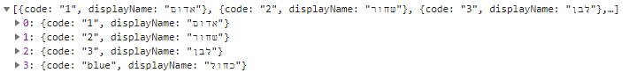

## **מסמך הטמעה moh-package 1.3.4**

## תקציר:

Package 1.3.4 מכיל תוספות קטנות ותיקוני באגים.

**באגים שטופלו:**

1. רכיב radiobutton-group  - תיקון באג במקרה שקיימים מספר רכיבים כאלו בדף.
2. שרות UmbracoDataService  - אפשרות לשליחת פרמטר filter בלי לשלוח ערך בפרמטר  select. [מפורט בהמשך](#תיקוני)
3. רכיב  - tooltipטיפול בנראות טולטיפ עם טקסט ארוך ב ie.
4. רכיב footer- כעת שולף נתונים ממקור פנימי (קובץ json) במקום מה DB


## הטמעה:

1.	עבור שימוש במנגנון ה Translate:
    - להסיר את ההפעלה של ה MohTtranslateService (אם קיימת) 
    בקובץ  app.component.ts בפונקציה ngOnInit: 

        ```typescript
        let defaultLanguage: string = 'he';

        this.translate.setDefaultLang(defaultLanguage);
        this.translate.use(defaultLanguage);
        ```

    - להוסיף את הערך "lang" בקובץ config.json – עבור קוד השפה שתשמש את האתר,  
     לדוגמה: `"lang"="he"`.  
    אם לא ישלח ערך , ברירת המחדל תהיה &quot;he&quot;.

## תיקוני באגים:

**Umbraco Data Serivce**

בוצע תיקון במתודות : getList, getTranslatedList עבור שימוש בפרמטר filter.

(המתודה getList מחזירה רשימה  בשפה הנוכחית באתר, לעומת זאת, המתודה  getTranslatedList מחזירה רשימה לפי השפה שנשלחה לפרמטר calture)

שימוש במתודות:

- קריאה למתודה עם  DocType בלבד (כאשר לא נשלח appName תילקח הרשימה מהתשתית)

    ```typescript
    umbracoDataService.getList('color')
    umbracoDataService.getTranslatedList('he','color','sideeffects')
    ```

    המתודה תחזיר observable המכיל את הנתונים הבאים (מערך של אובייקטים):  
    

- קריאה למתודה עם docType ושם האפליקציה (כאשר נשלח appName תילקח הרשימה מהאפליקציה שנשלחה בפרמטר זה)

    ```typescript
    umbracoDataService.getList('color','sideeffects')
    ```

    הרשימה תכיל מערך של אובייקטים, כאשר כל אובייקט יכיל רק את השדות שנשלחו בפרמטר select

- קריאה למתודה עם פרמטר select

    ```typescript
    umbracoDataService.getList('color',null,'code,displayName')
    ```

    הרשימה תכיל מערך של אובייקטים, כאשר כל אובייקט יכיל רק את השדות שנשלחו בפרמטר select

- קריאה למתודה עם פרמטר filter

    ```typescript
    umbracoDataService.getList('color',null,null,'code=1')
    ```

    הרשימה תכיל מערך של אובייקטים המכיל רק את האובייקטים המתאימים לתנאי שנשלח בפרמטר filter

- קריאה למתודה עם פרמטר select ו- filter

    ```typescript
    umbracoDataService.getList('color',null, 'code,displayName','code=1')
    ```

    הרשימה תכיל מערך של אובייקטים המכיל רק את האובייקטים המתאימים לתנאי שנשלח בפרמטר filter, כאשר כל אובייקט יכיל רק את השדות שנשלחו בפרמטר select.


## שימוש ביכולות:

**APP\_INITIALIZER**

בגרסה זו השתנה המיקום בו טוענים את שירות התרגומים.

עד עכשו היינו טוענים את השירות (ובכך מפעילים את ה loader שמביא את רשימת התרגומים)
ב app.component,
 מגרסה זו השירות כבר נטען אוטומטית באתחול של האפליקציה (APP\_INITIALIZER).

היתרון בכך הוא שהערכים המתורגמים מאומברקו נמצאים כבר בעליית האפליקציה וזמינים עבור הרכיבים השונים בשלב מוקדם יותר.

באתחול האפליקציה נטענים גם ערכי הקונפיגורציה לשרות ConfigService.