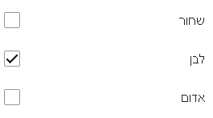
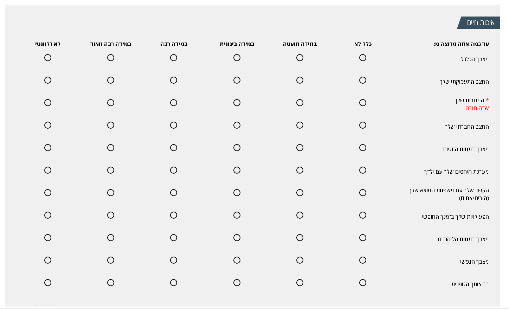
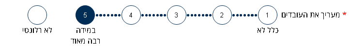

## **מסמך הטמעה moh-package 1.3.7**

## תקציר:

גירסה זו מכילה רכיבים חדשים, טיפול בהעלאת קבצים חתומים ובאגים קטנים.

**באגים שטופלו:**

1. הסרת הפוקוס על הפקד הלא ולידי בשמירת טופס. 

**היכולות שנוספו:**

1. טיפול בהעלאת קבצים חתומים. 
2. רכיב Rich Text Editor עבור עריכת טקסט עשיר. הרכיב מאפשר הדבקה מקבצים חיצוניים, הוספת נוסחאות, טבלאות ועוד.
3. רכיב [CheckboxGroup](./../../components/CheckboxGroupComponent.html) המכיל רשימה של Checkboxes
4. רכיב [RadiobuttonTable](./../../components/RadiobuttonTableComponent.html) המכיל טבלה כשכל שורה בטבלה היא בעצם RadioButtonGroup , הרכיב משמש עבור רשימה של שאלות עם אפשרויות בחירה זהות לכל שאלה
5. רכיב [Rating](./../../components/RatingComponent.html) המציג אפשרויות בחירה לשאלה כשכל אפשרות ממוספרת בסדר עולה והמשתמש נדרש לדרג- לבחור אפשרות אחת

## שימוש ביכולות:

**File Upload Module**

התווסף שירות API עבור העלאת קבצים חתומים.
צורת השימוש ברכיב ה File Upload הוא באותו אופן רק שיש להוסיף פרמטר בשם isSigned ולהגדיר אותו true באובייקט ה settings שנשלח לרכיב.


```typescript

  settings: UploaderSettings = new UploaderSettings();
  
    this.settings.allowMimeTypes = ['image/png', 'image/gif', 'video/mp4', 'image/jpeg'];
    this.settings.maxFileSize = 1 * 1024 * 1024;
    this.settings.queueLimit = 5;
    this.settings.isMultiple = true;
    this.settings.hasDescription = true;
    this.settings.queueMinLimit = 0;
    this.settings.isDescriptionRequired = true;
    this.settings.isRequired = true;
    this.settings.isSigned = true;
```
```html
     <moh-file-upload [uploaderSettings]="settings"
                      [buttonText]="'+ בחר קובץ'"
                      [fieldText]="'תיאור הקובץ'"
                      formControlName="uploader"
                      [MarkAsRequired]=true>
     </moh-file-upload>
```

**Rich Text Editor Module**

קומפוננטה חדשה עבור עריכת HTML עשיר.
הקומפוננטה תומכת בהדבקת טקסט מקבצים חיצוניים, עריכת נוסחאת, טבלאות, עיצוב שונה ועוד.

הקומפוננטה משתמשת ברכיב ng2-ckeditor.
הקומפוננטה מגדירה קונפיגורציה דיפולטיבית וניתן לשנות את הקונפיגורציה ע"י שליחת אובייקט config עם הגדרות אחרות שידרסו את הגדרות ברירת המחדל.

אפשרויות לקונפיגורציה ניתן לראות בלינק הבא:
https://ckeditor.com/docs/ckeditor4/latest/api/CKEDITOR_config.html

יש להוסיף בקובץ index.html את ה script הבא:
```html
  <script src="https://cdn.ckeditor.com/4.11.3/full-all/ckeditor.js"></script>
```

הקונפיגורציה ברכיב ניתנת לשינוי/ דריסה ע"י שליחת אובייקט config ל input הבא:
@Input() config

דוגמא לשימוש עם הגדרות ברירת המחדל:
```html
  <moh-rich-text-editor formControlName="richTextEditor"></moh-rich-text-editor>
```
דוגמא לשימוש עם הגדרות אישיות:

```typescript
  this.config = {};

  this.config['uiColor'] = '#AADC6E';
    this.config['toolbarGroups'] = [
      { name: 'document', groups: ['mode', 'document', 'doctools'] },
      { name: 'clipboard', groups: ['clipboard', 'undo'] },
      { name: 'editing', groups: ['find', 'selection', 'spellchecker'] },
      { name: 'forms' },
      '/',
      { name: 'basicstyles', groups: ['basicstyles', 'cleanup'] },
      { name: 'paragraph', groups: ['list', 'indent', 'blocks', 'align', 'bidi'] },
      { name: 'links' },
      { name: 'insert' },
      '/',
      { name: 'styles' },
      { name: 'colors' },
      { name: 'tools' },
      { name: 'others' },
      { name: 'about' }
    ];
```
```html
        <moh-rich-text-editor formControlName="richTextEditor" [config]="config"></moh-rich-text-editor>

```
**Checkbox Group Module**  
רכיב המכיל רשימה של ceckboxes , משמש עבור אפשרות של בחירה מרובה ברכיב אחד  
למידע נוסף : [CheckboxGroup](./../../components/CheckboxGroupComponent.html)  
  

**RadioButton Table Module**  
רכיב המכיל רשימה של radiobuttonGroup , משמש עבור סקר כאשר ישנן רשימה של שאלות עם אפשרויות של בחירה זהות עבור כל השאלות ברכיב  
למידע נוסף : [RadiobuttonTable](./../../components/RadiobuttonTableComponent.html)  
  

**Rating Module**  
רכיב דירוג, משמש בעיקר עבור סקר ומאפשר להכניס שאלה ורשימת אפשרויות כאשר כל אפשרות היא מספר 1 עד n  או "לא רלוונטי"  
למידע נוסף : [Rating](./../../components/RatingComponent.html)  
  


