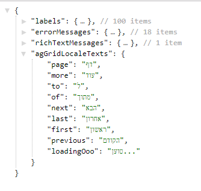

## **מסמך הטמעה moh-package 1.3.8**

## תקציר:

גירסה זו מכילה תמיכה בשליפת ערכים מאומברקו במבנה ביררכי.

## הטמעה:

1. עבור שימוש בטקסטים מאומברקו:
    המפתחות ברשימת התרגומים של שרות ה translate השתנו.
    כעת מכילים גם את ה document type:
 
    

    לדוגמה: המפתח של הערך firstName הנמצא ברשימת ה labels יהיה: &quot;labels.firstName&quot;
    ולא  &quot;firstName&quot; בלבד - כפי שהיה עד עתה.  
    כדי לשלוף את הטקסט של הערך firstName יש לשלוח לשרות ה translate את המפתח כך: labels.firstName ה document type הוא 'labels'.  

    פרוט:  
    ברכיבי התשתית (וכן במחלקה LabelBase)הוגדרה ברירת מחדל ל docType &quot;labels&quot; כך ש **אם משתמשים ב docType הדיפולטיבי לא צריך לשנות את המפתח הנשלח.**

    אם משתמשים ב docType שונה יש לשלוח את המפתח המלא כולל ה docType.
    (docType.keyInUmbraco)

    פרוט על רכיבים עם docType שונה:

    - **הודעת שגיאה בפונקציות ולידציה –**
    בהגדרת ולידציה על formControl בין אם זה ולידציה תשתיתית ובין אם זה ולידציה מותאמת אישית יש לשלוח ב errorMessageKey את המפתח של הודעת השגיאה ללא הקידומת -   **אין שינוי בשרות זה** ( **יש לוודא** שהערך הזה נמצא באומברקו ברשימת ה errorMessages).
    - **רכיב rich-text-message -**
    **ללא שינוי** – הרכיב משרשר לתחילת המפתח שנשלח את ה docType &#39;richTextMessages&#39;
    כך שיש לשלוח לרכיב זה רק את המפתח הספציפי ללא הקידומת של ה docType.
    (יש לוודא שהערך שנשלח ב messageKey נמצא באומברקו ברשימת ה &#39;richTextMessages&#39;).

2. שרות UmbracoDataservice.getDictionary - 

    מחזיר כעת את רשימת ה dictionary במבנה היררכי מקובץ לפי ה document type.
