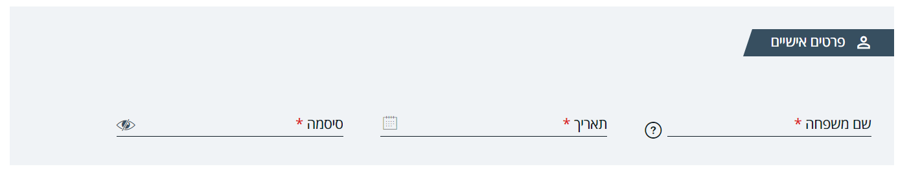

<div dir=rtl>

## **מסמך הטמעה moh-package 2.0.1**

## תקציר:

גירסה זו מכילה תיקונים ויכולות חדשות.

**באגים שטופלו:**

1. **moh-wizard** - תיקון בעיצוב במצב מובייל. 
 
2. **mat-table-paginator** - תיקון באג להציג תמיד את הדף הנוכחי.  
3. **moh-datepicker** - אתחול הlocale לפי השפה הנוכחית.  
4. **moh-signature-pad** - תיקון באג ב input penColor.  
5. **moh-file-upload** 
    - תיקון בעיצוב הרספונסיבי ובמיקום של הודעת השגיאה כאשר יש להזין תיאור.  
    - תיקון באג באתחול הרכיב ברשימת  קבצים קיימת.
6. **moh-select-language** - הצגת השפה הנוכחית גם כאשר נשלחה רשימת שפות מותאמת אישית.  
7. **draft model** - שינוי שם השדה המחזיק את הjson מ model ל json בהתאם לשינוי שבוצע במודל הקיים  בסרבר.  
8. **moh-section-title** - תיקון בעיצוב.  
9. **moh-radiobutton-group** - תיקון באג באיתחול של הרכיב וכן ב input freeTextOption שיקבל את ה value ולא את כל האוביקט במקרה של שימוש ב valueField.  
10. **moh-wizard-route** - שמירת נתוני הטופס בלחיצה על הכפתורים 'הבא' או 'הקודם' במקרה שהערך שנשלח לinput nextIfValid או prevIfValid הוא false.  
11. **translate** - תיקון באג בטעינה כפולה של רשימת ה labels.  
12. **ng build --prod** - תיקון עבור שגיאה שהופיעה בהרצה של ng build --prod.  
13. **moh-select** - לאחר בחירת ערך לא היה ניתן לפתוח שוב את הרשימה אלא רק לאחר העברת הפוקוס לרכיב אחר.

**היכולות שנוספו:**

1. **moh-mat-table**  
   
    - *moh-mat-table-filter* 
      - נוסף @Input חדש כדי לאפשר הזנת תאריך דרך התאריכון בלבד.
      - נוסף סוג חדש של מסנן: type=toggle
    - נוסף @Input לשליחת ערך ברירת מחדל למסנן.  
  
2. **moh-button** - נוסף Input type הקובע את סוג ה button.  
3. **moh-datepicker** - נוספו inputs לשינוי הודעות השגיאה של הרכיב.  
4. **moh-header** 
      - נוסף input המקבל רשימת שפות להצגה בתפריט במצב מובייל. 
      - נוספה אפשרות להצגת רכיב aad-login-cube בתוך רכיב ה header.   
5. **moh-select-language** - נוסף input המקבל את רשימת השפות להצגה.  
6. **DataService** - נוספו פונקציות חדשות לשליפת מוסדות.  
7. **JsonDataService** - נוסף שרות לשליפת רשימות מקובץ json לפי שפות.  
8. **mohValidators** - נוספה ולידציה הבודקת התאמה ל pattern, ומודיעה אילו תווים לא חוקיים -אם קיימים.  
9. **moh-wizard-route**
   - נוספה יכולת להגדיר step כלא מאופשר.  
   - נוסף input המגדיר האם לאפשר שמירה גם כאשר הטופס לא תקין.
   - נוספה פונקציה המופעלת בלחיצה על מעבר לשלב הקודם ומשמשת לביצוע פעולות לפני המעבר בפועל. 
10. **moh-file-upload** 
    - נוסף Input placeholderKey לתיבת הטקסט של תיאור הקובץ.  
    - נוספה אפשרות לשלוח את סיומות הקבצים המותרים ללא צורך בהגדרת ה mimeType.
11. **moh-radiobutton-group** - נוסף מודל המייצג את הערך של הרכיב במקרה של שימוש ב freeTextOption.  
12. **moh-select** - נוספו outputs להחצנת outputs הקיימים במטריאל.  
13. **moh-form-card** - עדכון העיצוב של הרכיב, הצגה של הרכיב section-title והוספה של input בהתאם.  
14. **AddressService** - החצנה של שרות המכיל פונקציות לשליפת ערים ורחובות מה EDM.
15. **dashboard** - נוסף רכיבים חדשים: [moh-dashboard-card](../../components/DashboardCardComponent.html), [moh-dashboard-graph](../../components/DashboardGraphComponent.html), [moh-dashboard-summary](../../components/DashboardCardSummaryComponent.html).  
16. **moh-rich-text-tooltip** - נוסף רכיב חדש להצגת טולטיפ עם טקסט עשיר.
17. **print** - נוספה יכולת להדפסת תוכן של רכיב.


## שימוש ביכולות:

**moh-mat-table**

-  *moh-mat-table-filter* -  נוסף @Input() חדש שניתן לשימוש במקרה שרוצים סינון לפי תאריך שיבחר דרך התאריכון בלבד ללא אפשרות הקלדה.
ברירת מחדל false.
    ```typescript
    /**
    * In case that the filter is date picker, You can choose if
    * the input is disabled.
    */
    @Input() inputDisabled: boolean = false;
    ```
- *moh-mat-table-general-search*, *moh-mat-table-filter* - נוסף Input שניתן לשימוש במקרה שרוצים לשלוח ערך ברירת מחדל למסנן:
    ```typescript
    /**
    * The default value to filter by
    */
    @Input() defaultValue?: any = '';
    ```
- *MohMatTableService* - נוספה פונקציה המחזירה את הערך הקיים בשדה החיפוש הכללי. 
    ```typescript
    getGeneralSearch(): any
    ```
  

**moh-datepicker**  
נוספו inputs שמקבלים את הkey של הודעות השגיאה, אם לא נשלח ערך תוצג ברירת המחדל:
```typescript
  /** 
  * Error message text key when max date error accourd.
  */
  @Input() maxDateErrorMessageKey: string = null;
  /** 
  * Error message text key when min date error accourd.
  */
  @Input() minDateErrorMessageKey: string = null;

```
**moh-header**  
נוסף input המקבל רשימת שפות להצגה בתפריט במצב מובייל, אם לא נשלחה רשימה, רשימת השפות תשלף מאומברקו.
 ```typescript
  /**
   * List of languages to show in [SelectLanguageComponent]{@link SelectLanguageComponent#languagesListApps}.
   */
  @Input() languagesList?: Language[];
 ```
**moh-select-language**  
נוסף input המקבל את רשימת השפות להצגה, אם לא נשלחה רשימה, רשימת השפות תשלף מאומברקו.
 ```typescript
  /**
  * List of languages to show. (Useful when not using Umbraco).
  */
  @Input() languagesList?: Language[];
 ```
**DataService**  
נוספו פונקציות לשליפת מוסדות:
 ```typescript
   getHospitalsList(): any 
   getHMOList(): any 
   getHospitalsAndHMOList(): any 
   getInstitutes(): any 
 ```

 **JsonDataService**  
 נוסף שרות לשליפת רשימות מקובץ json לפי שפות.  
 השרות שולף את אובייקט ה json מקובץ או מ api לפי ערכי הקונפיגורציה שהוגדרו, עם שרשור של השפה הנוכחית,  
 יש להגדיר את הערכים בקובץ config.js:  
 jsonListsPrefixURL - תחילת הנתיב,  
 jsonListsSuffixURL - הסיומת של הנתיב, ברירת המחדל היא 'json.'.  
 לדוגמה: שם הקובץ הוא 'he.json' והוא נמצא ב 'assets' בתוך תיקייה 'lists', במקרה זה יש להגדיר בקובץ  config: 
  ```typescript 
 "jsonListsPrefixURL": "/assets/lists/"  
 ```
 והשרות יפנה ל: "/assets/lists/he.json".  
 השרות מכיל את הפונקציות הבאות:
 ```typescript
 getList(listName: string): Observable<any[]>
 getLanguages(): Observable<any[]>
 ```
 הפרמטר listName מקבל את שם המאפיין באובייקט ה Json המכיל את הרשימה,  
 בהחלפת שפה מתקבלת רשימה חדשה בהתאם לשפה.
 
 **mohValidators**  
 נוספה ולידציה לבדיקת התאמה ל pattern, במקרה שהוזנו תווים לא חוקיים הם יוצגו בהודעת השגיאה:
 ```typescript
   static notMatch(pattern: any, message?: string, messageKey: string = 'notMatch'): ValidatorFn 

//example:
mohValidators.notMatch("[a-zA-Z ]*");
 ```

**moh-wizard-route**  
 - נוספה יכולת להגדיר step כלא מאופשר.  
נוסף מאפיין לclass Step :
    ```typescript
      /**
      * Tab Concept only! Whether the element is disabled.
      */
      disabled?: boolean;
    ```
  - נוסף input המגדיר האם לאפשר שמירה גם כאשר הטופס לא תקין:
      ```typescript
      /**
      * Whether to enable the Submit(Save) button only when the current form is valid.
      */
      @Input() doSubmitIfValid: boolean = true;
      ```
  - נוספה פונקציה למחלקה  WizardStep המופעלת בלחיצה על מעבר לשלב הקודם ומשמשת לביצוע פעולות לפני המעבר בפועל, הפונקציה מחזירה observable בוליאני המגדיר האם ניתן לבצע את המעבר,  ניתן לדרוס אותה ולהחזיר ערך בהתאם לרצוי.
     ```typescript
      /**
      * A function that returns a value indicating whether it is possible to proceed to the prev step.
      */
      canPrev?(): Observable<boolean>
      ```

 **moh-file-upload**  
  - נוסף Input placeholderKey לתיבת הטקסט של תיאור הקובץ: 
    ```typescript
    /**
       * Placeholder text key to display in the textbox.
      */
      @Input() placeholderKey: string = '';
    ```
  - וכן נוספה אפשרות להגדיר את ה key של הודעת השגיאה שתופיע במקרה שחובה להזין תיאור, ברירת המחדל של ה key  יהיה fileUploadDescRequire,  ניתן לשנות אותו במאפיין descRequiredMessage שנוסף לאובייקט UploaderSettings. 
   - נוספה אפשרות לשלוח את סיומות הקבצים המותרים ללא צורך בהגדרת ה mimeTypes במאפיין allowMimeTypes, לשם כך נוסף מאפיין לאובייקט UploaderSettings:
      ```typescript
      allowExtensions?: string[];
      ```
  

 **moh-radiobutton-group**  
 נוסף מודל המייצג את הערך של הרכיב במקרה של שימוש ב freeTextOption:  
 ```typescript
class FreeTextOption {
  radioGroup: any;
  freeText: string;

  constructor(radioGroup: any, freeText: string)
}
 ```

 **moh-select**  
 נוספו outputs להחצנת outputs הקיימים במטריאל:
  ```typescript
/**
  *Event that is emitted whenever an option from the list is selected.
  */
  @Output() optionSelected: EventEmitter<MatAutocompleteSelectedEvent> = new EventEmitter();
  /**
  *Event that is emitted when the autocomplete panel is closed.
  */
  @Output() closed: EventEmitter<void> = new EventEmitter();
  /**
  *Event that is emitted when the autocomplete panel is opened.
  */
@Output() opened: EventEmitter<void> = new EventEmitter();

 ```

 **moh-form-card**  
 עדכון העיצוב של הרכיב, והצגה של הרכיב section-title כך:  
   
 נוסף @Input המקבל את שם האייקון שיוצג בכותרת:

```typescript
/**
  * The icon to display on the section-title.
  */
  @Input() icnName: string;
```  

**AddressService**  
 שרות המכיל פונקציות לשליפת ערים ורחובות מרשימות ה EDM:
```typescript
getCities(): Observable<any[]>
getStreets(): Observable<any[]> 
```  
**moh-rich-text-tooltip**  
נוסף רכיב חדש להצגת טולטיפ עם טקסט עשיר.  
הרכיב מכיל input המקבל את הhtml שיופיע בטולטיפ:
```typescript
@Input() html?: string;
```
אופן השימוש: יש לעטוף את האלמנט - שבמעבר עליו יוצג הטולטיפ - כך:
```html
   <moh-rich-text-tooltip [html]="tooltip_rich_text">
    <p>
       dispaly rich tooltip when mouse hover
    </p>
   </moh-rich-text-tooltip>
```
ניתן לשלוח את ה html שיופיע בטולטיפ ישירות בתוך הרכיב במקום לשלוח כ input, האלמנט שמכיל את התוכן שיוצג ב html צריך להכיל  את ה attribute tooltip-content-section:
  
```html
<moh-rich-text-tooltip>
    <p>
    ...Content...
    </p>
    <div tooltip-content-section>
      <p>...Tooltip HTML...</p>
    </div>
</moh-rich-text-tooltip>
```
**print**  
נוספה יכולת להדפסת תוכן של רכיב.  
אופן השימוש: יש להגדיר את הרכיב שאותו רוצים להדפיס ב routing של האפליקציה :
```typescript
  {
    path: 'print',
    outlet: 'print',
    component: PrintLayoutComponent,
    children: [
      { path: 'path-to-print', component: ToPrintComponent }
    ]
  },
``` 
ישנן שתי אפשרויות כדי לפתוח את הרכיב במצב הדפסה:  
 - יש להפעיל את הפונקציה 
    printDocumentByPath של השרות PrintService:
    ```typescript
    this.printService.printDocumentByPath('path-to-print');
    ```
 -  להשתמש ברכיב moh-print המכיל כפתור שבלחיצה עליו מופעלת הפונקציה של ההדפסה:
      ```html
      <moh-print [textKey]="'print'" [path]="'user'" position="right" ></moh-print>
      ```
בנוסף לכך יש להפעיל את הפונקציה onDataReady של השרות PrintService ברכיב שאותו מדפיסים, לדוגמה:
```typescript
  ngOnInit() {
    this.tableDataService.getUser().subscribe((res) => {
      this.user = res[0];
      this.printService.onDataReady();
    });
  }
````

